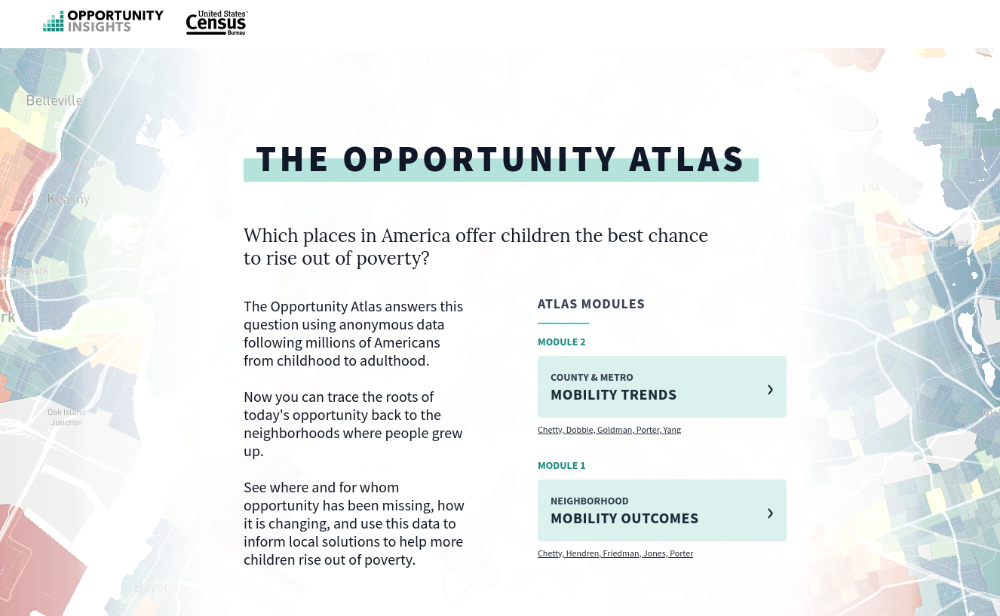

# Who are we?

## Your instructors

::::{.columns}
::: {.column width="50%"}

:::
::: {.column width="50%"}

:::
::::

## Michael Stepner {.smaller}

::::{.columns}
::: {.column width="50%"}

Assistant professor at the [University of Toronto](https://economics.utoronto.ca/) and a Research Principal at [Opportunity Insights](https://opportunityinsights.org/), a lab based at Harvard University.

:::
::: {.column width="50%"}

:::

::::

## Lars Vilhuber {.smaller}

::::{.columns}
::: {.column width="50%"}

Executive Director of the [Labor Dynamics Institute](http://www.ilr.cornell.edu/ldi) and Senior Research Associate in the [Economics Department](http://economics.cornell.edu/) at [Cornell University](http://www.cornell.edu/), and the [American Economic Association](https://www.aeaweb.org/)’s Data Editor.

:::

::: {.column width="50%"}

:::

::::

## Data Editor of the AEA

::::{.columns}
::: {.column width="50%"}

2389 Manuscripts and 4440 Reports, approx. 4400 authors reached.

:::
::: {.column width="50%"}

:::
::::
