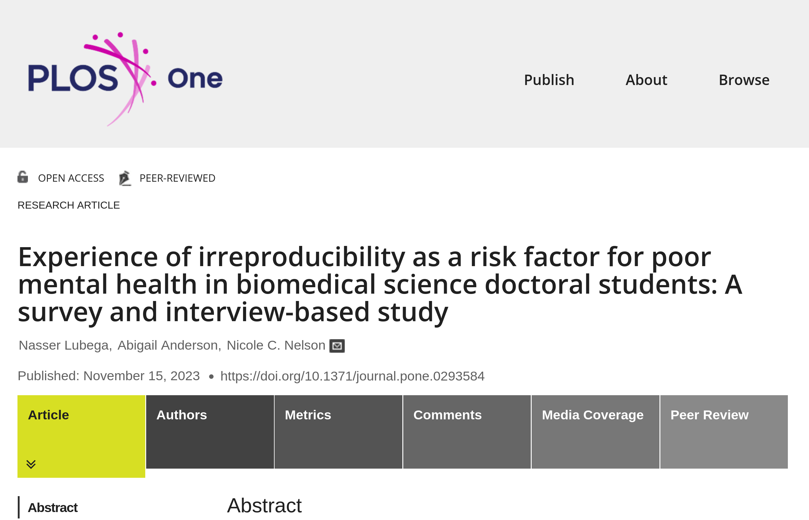

# Best practices? {background-image="images/lake-steaming.jpg" background-size="contain" background-position="bottom"}

## Summing up {.smaller}

::::{.columns}

:::{.column width="50%"}

- **Why**
  - Credibility
  - Transparency (openness)
  - Efficiency of scholarly discourse ([example])
- *How*
  - FAIR principles
  - Data Citation Principles
  - Computational Reproducibility 
:::

:::{.column width="50%"}

- As **Replication Packages**
  - Code
  - Data
  - Materials (for surveys, experiments, ...)
  - Instructions on how to obtain data not included
  - Instructions on how to combine it all
  - Known issues documented

:::
::::

# Who? {background-image="images/lake-summer.jpg" background-size="contain" background-position="bottom"}

## Who?

:::::{.columns}
::::{.column width="50%"}

- 🐇 Authors at **conditional acceptance** 
- 🐢 Authors at *submission*
- 🐁 Authors at **beginning** of project

::::

::::{.column width="50%"}

- 👴🏻👵🏽 Experienced researchers
- 👶🏽👶🏻 Junior researchers
- 👨‍🎓👩‍🎓 Ph.D. students
- 🧒👦 Undergraduates 

::::
:::::

## Who? 

:::::{.columns}
::::{.column width="30%"}

::::

::::{.column width="40%"}

You.

::::

::::{.column width="30%"}

::::

:::::

## You

:::::{.columns}

::::{.column width="50%"}

👶🏻 Now:

- more efficient development
- more efficient collaboration
- more assurance that "everything just works"

::::

::::{.column width="50%"}

👵🏽 Soon

- more efficient development across projects
- more efficient response to editors and referrees
- ... while you are in a **new** institution, on a *new computer*, with three courses to **prep**, and (luxury!) a **RA** you can delegate to...

::::

:::::

## You

